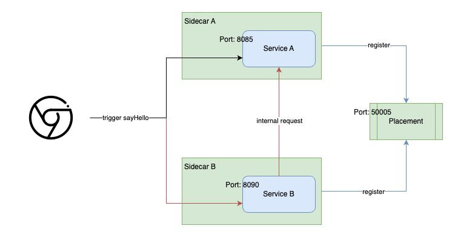

This is the simple demo about the service communication via Dapr.

# Overview
To enable communication between Service A and Service B using Dapr, each service will interact with its respective Dapr sidecar.


# Development

## Service A
This is a simple REST api with 1 endpoint only
```java
@Slf4j
@RestController
@RequestMapping("/hello")
public class HellController {

    @GetMapping
    @ResponseBody
    public HelloDto sayHello() {
        log.info("Say hello");
        return new HelloDto("Hello from Service A");
    }
}
```

## Service B
Similar with Service A, however when calling sayHello, it will make request to Service A
```java
@Slf4j
@RestController
@RequestMapping("/hello")
public class HellController {

    private final ServiceACaller serviceACaller;

    public HellController(ServiceACaller serviceACaller) {
        this.serviceACaller = serviceACaller;
    }

    @GetMapping
    @ResponseBody
    public HelloResponseDto sayHello() {
        log.info("Say hello");
        var helloDto = serviceACaller.sayHello();
        return new HelloResponseDto("Hello from Service B", helloDto);
    }
}
```

```java
@Service
public class ServiceACaller {

    private static final String SERVICE_NAME = "service-a";

    private final DaprClient client;

    public ServiceACaller() {
        this.client = new DaprClientBuilder().build();
    }

    public HelloDto sayHello() {
        return client.invokeMethod(SERVICE_NAME, "hello", "", HttpExtension.GET, HelloDto.class).block();
    }
}
```

```yml
implementation 'io.dapr:dapr-sdk:1.11.0'
```

# Deployment
```yml
services:
  placement:
    image: daprio/dapr:latest
    container_name: dapr_placement
    command: [ "./placement", "--port", "50005" ]
    ports:
      - "50005:50005"

  service-a:
    image: service-a:latest
    container_name: dapr_service_a
    ports:
      - "8085:8085"
    depends_on:
      - placement

  sidecar-a:
    image: daprio/daprd:edge
    container_name: dapr_sidecar_a
    command: [ "./daprd",
               "--app-id", "service-a",
               "--app-port", "8085",
               "--placement-host-address", "placement:50005" ]
    depends_on:
      - placement
      - service-a
    network_mode: "service:service-a"

  service-b:
    image: service-b:latest
    container_name: dapr_service_b
    ports:
      - "8090:8090"
    depends_on:
      - placement

  sidecar-b:
    image: daprio/daprd:edge
    container_name: dapr_sidecar_b
    command: [ "./daprd",
               "--app-id", "service-b",
               "--app-port", "8090",
               "--placement-host-address", "placement:50005" ]
    depends_on:
      - placement
      - service-b
    network_mode: "service:service-b"

```
